# Dynamic memory allocator

## 堆

堆在内存当中是向上生长的，对于每一个进程，都有一个`brk`指针指向堆的顶部


allocator会把堆看成一组大小不同的**块(chunk)**的集合来维护，每个块都是一组连续的虚拟内存片(chunk)，有以下两种状态：

- allocated

显示地留给程序使用，直到被释放(free)

- free

空闲的块保持空闲，直到分配给程序使用


allocator有两种风格来分配块：

- Explicit allocator

在C当中通过malloc和free来分配和释放内存

- Implicit allocator

allocator自动检测一个已被分配的块什么时候不再被程序使用，如果不使用，那就**自动**释放这一个块，在高级语言当中被称为垃圾回收机制（GC）


## Explicit Allocator当中的常用函数

### `malloc`

```c
#include <stdlib.h>
void *malloc(size_t size);
```

显示分配内存的大小，类似的函数还有`calloc`:分配的时候置零，`realloc`，重新分配已分配空间的大小

### `sbrk`

```c
#include <unistd.h>
void *sbrk(intptr_t incr);
```

直接调整brk指针的位置来改变堆的大小

### `free`

```c
#include <stdlib.h>
void free(void *ptr);
```

释放已分配的堆空间

### Example

我们来看书上的一个简单例子，说明这些函数表面上是如何工作的

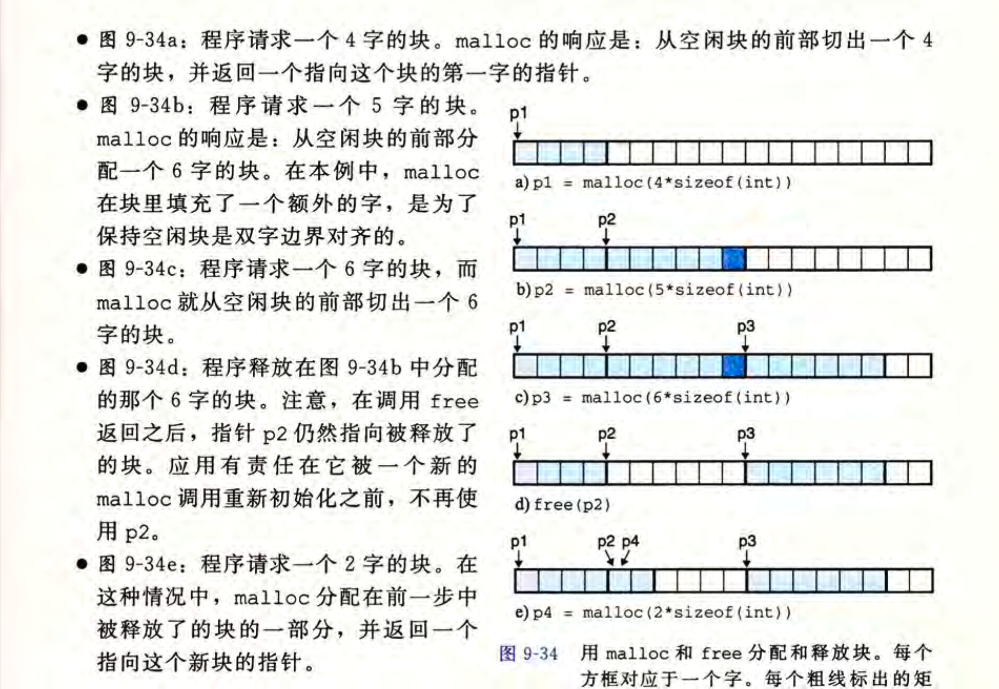


## 动态内存分配

- 为什么要使用动态内存分配？

比如我们需要allocate一个可变数组，数组的长度只有程序运行的时候知道，这个时候我们就要运行时分配内存来避免不断重新编译带来的麻烦

### 分配的目标和要求

约束条件：

- 处理任意序列分配请求

allocator不能假设malloc和free的顺序，每个free必须对应一个allocated块

- 立即响应请求

不能重新排列块，不能调整请求顺序

- 只用堆
- 对齐块

用来保存任意类型的数据

- 不修改已分配的块


性能目标：

- 最大化I/O

在堆上最快分配，最好让分配时间的上界  正比于空闲块的数量，而free保持在常数时间内

- 最大化内存使用率

让整个请求序列的峰值利用率U最大,其中P为聚集有效载荷，也就是当前已请求的块的大小的总和，H为堆的大小
$$
U_k=\frac{max_{i\leq k}P_i}{H_k}
$$

### 碎片

#### 内部碎片

例如图示当中的9-34(b)，allocator强加给已分配块的大小，为了对齐以及其他的约束条件

取决于allocator自身的设定

#### 外部碎片

例如图示当中9-43(e)最后的两个块，由于现有的堆大小不够，新申请堆的大小超过了需要分配的内存块

不仅取决于之前请求的模式和allocator自身的机制，还取决于**将来**的请求模式


### 实现问题

最简单的形式就是维护一个字节数组，每次申请的都是最后的字节，free就把数字中记录的块位置释放掉，这样很简单但是对堆的利用率相当低

我们一共要处理的就是以下四个问题

- 空闲块的组织
- 放置：如何选择合适的内存块来放新分配的块
- 分割：新分配的块放到某个空闲块以后，如何处理这个内存块当中的剩余部分
- 合并：处理刚刚被释放的块

#### 隐式空闲链表

https://zhuanlan.zhihu.com/p/376217387

一个数据结构用于区分块的边界，区分allocated/unallocated块

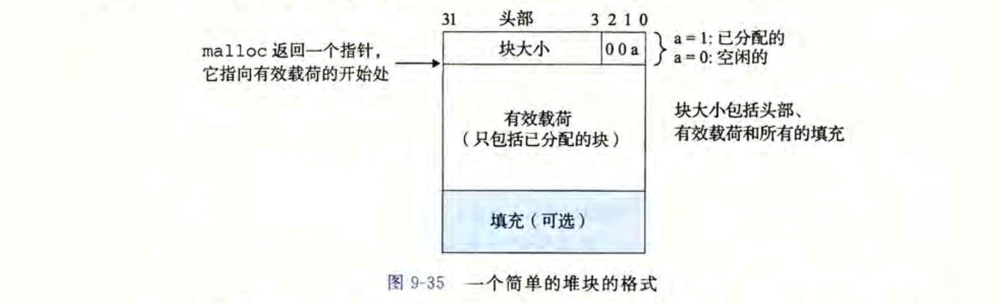

- 块头部值计算

以上述图示的块为例

假设一个**已分配**的块大小是0x18个字节，那么具有以下头部：`0x00000018 | 0x1 == 0x00000019`

假设一个**未分配**的块大小是0x28个字节，那么具有以下头部：`0x00000028 | 0x0 == 0x00000028`

- 隐式空闲链表构建的堆

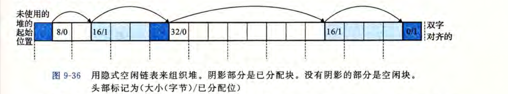

构造起来相当简单，缺点就是每次分配都需要堆整个链表进行搜索，和allocated/free块的大小呈线性关系

第一个和最后一个块标记为开始块和结束块

##### 放置策略

对于要放入堆的块，找足够大的空闲链表节点来放置块的算法

- 首次适配(first fit)

从头开始搜索，选择第一个合适的空闲块

缺点：链表头部会产生很多小的碎片，优点：大的空闲块更多在链表的后面

- 下一次适配(next fit)

从上一次搜索结束的地方开始搜索

缺点：内存利用率低，优点：效率高

- 最佳适配(best fit)

检查每一个空闲块，找到适合的**最小的**空闲块

缺点：每个都要搜索，很慢，优点：内存的利用率最高


##### 分割空闲块

减少大块的内存碎片，当放置策略匹配不太好的时候，会把空闲的块进行分割

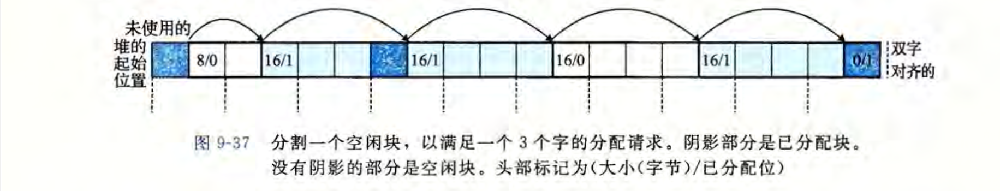

##### 获取额外的堆内存

堆内存不够用的时候调用`sbrk()`来增加堆空间，新放置的块被放置在隐式空闲链表的尾部

##### 合并空闲块

类似于分割的反过程，释放的时候会发生假碎片问题

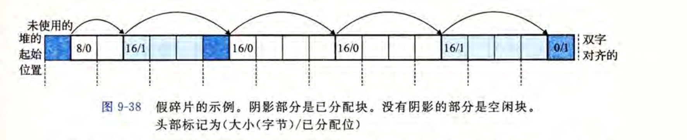

合并(coalescing)一共有两种策略

- 立即合并

每一次free马上就和相邻的空闲块合并

在常数时间内完成，可能会产生抖动，不断地合并分割

- 推迟合并

过一段时间合并，比如等到allocate请求失败的时候扫描整个堆，合并空闲块

一般快速的分配器会采用某种形式的推迟合并


##### 带边界标记的合并

合并的时候需要搜索整个链表来发现邻近的空闲块，这样消耗是非常大的，*Knuth*提出**边界标记**技术，每个块最后位置做为一个脚标，是头部的一个副本，这样就可以让一个块检查前一个块的脚标来获得前一个块的状态

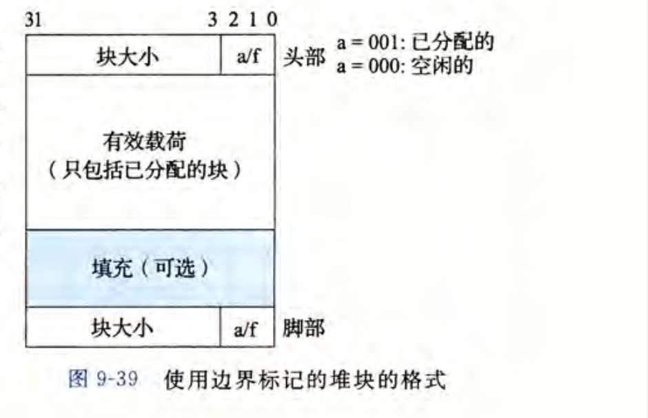

下面展示用这种技术合并四种前后块状态的操作

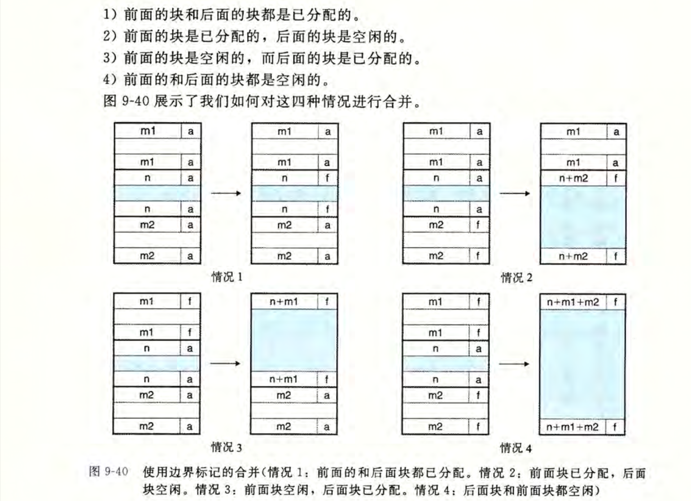


有一种更优化的方法就是，allocated chunk最后放弃脚标来节省空间，相应的，头部的三个标记位的第二个记录上一个chunk的a/f状态，但是free chunk还是要保留脚标的

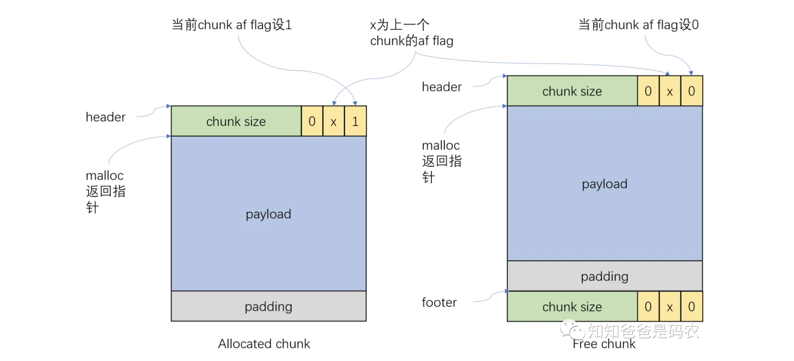

#### 显式空闲链表

和隐式空闲链表的唯一区别就是，把空闲块组织成一个双向空闲链表，包含一个前驱和后继

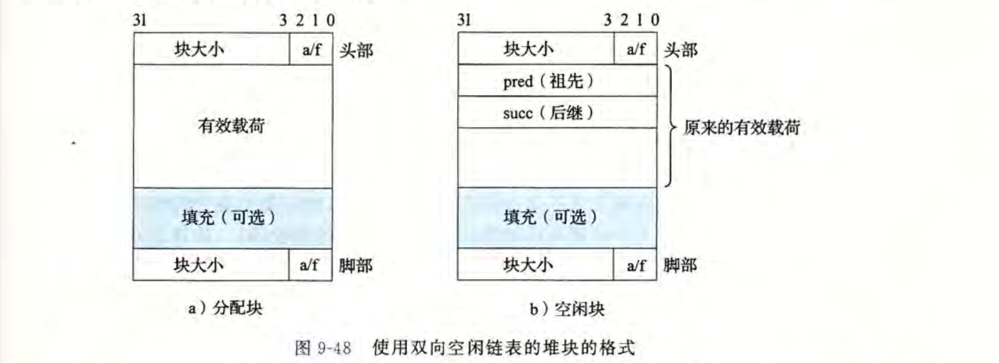

这样一来可以把首次分配的时间从正比于**块**总数量降低到**空闲块**总数量

释放块的时间取决于排列空闲链表的策略

##### 排列空闲链表的策略

- LIFO

新释放的块放在链表的开始处

- 地址顺序

按照地址的大小排列空闲链表


显示空闲链表的缺点就是空闲块必须要大，因为每个块要存储的信息太多


#### 分离式空闲链表

把不同大小的块归并成一个**类**，然后分离存储这些类的链表

比如，我们可以按照2的幂来分类{1}{2},{3,4},{5~8},...,{4097~infty}

Allocator维护一个空闲链表数组，按照大小升序排列，allocator需要一个大小为n的块的时候就到对应的链表当中寻找，不匹配就找下一个链表

有非常非常多的分离式空闲链表方法，在书中介绍以下两种

##### 简单式分离存储

每个类当中所有的块都是其中最大元素的大小，比如{17~32}类当中所有的空闲链表大小都是32

- 分配

给定一个给定大小的块，检查相应的空闲链表

链表非空：分配第一块的全部（空闲块不会分割）

链表为空：向操作系统请求一个大小固定的额外内存片（页大小的整数倍），分成大小相等的块，拼接成新的空闲链表

- 释放

把块放到链表的头部

 

优点：效率高，不需要分割和合并，链表单向可以去掉脚标，

缺点：很容易造成内部碎片和外部碎片


##### 分离适配

GNU malloc用的方法

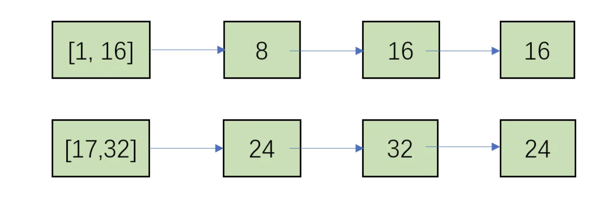

- 分配

给定一个大小确定的块，先找到相应类对应的链表，之后通过分配策略（前面提到的三种fit）来填入块，如果找不到就找下一个类

如果空闲链表当中没有合适的块，就向操作系统当中多申请一个块，然后把剩余的部分放在合适的类当中

- 释放

合并，把结果放在对应类的空闲链表当中


##### 伙伴系统

所有的块都是2的幂

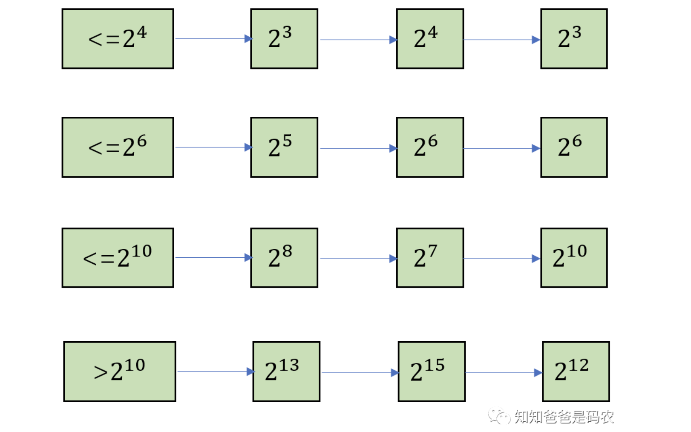

- 分配

对于每个确定大小的请求块，**向上舍入**到最接近2的幂，查找对应的链表

书上分配方法讲的太好了，懒得打了

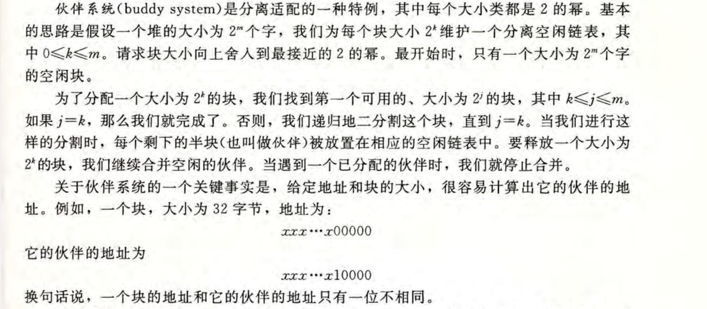

优点就是快速搜索和快速合并

缺点在于由于块大小都是2的幂，会产生显著的内存碎片


## 垃圾收集器

GC把内存视为一张有向可达图，所有的不可达节点被视为垃圾，就是不能被程序再次使用的

GC就是释放这些不可达节点，并返回给空闲链表，来**定期**回收他们


对于C语言设计的GC，一般分为mark和sweep阶段

- mark

从根节点出发，递归调用自己，标记块，所有未被标记的点被视为不可达的

- sweep

在堆上反复循环，释放所有未被标记的块

