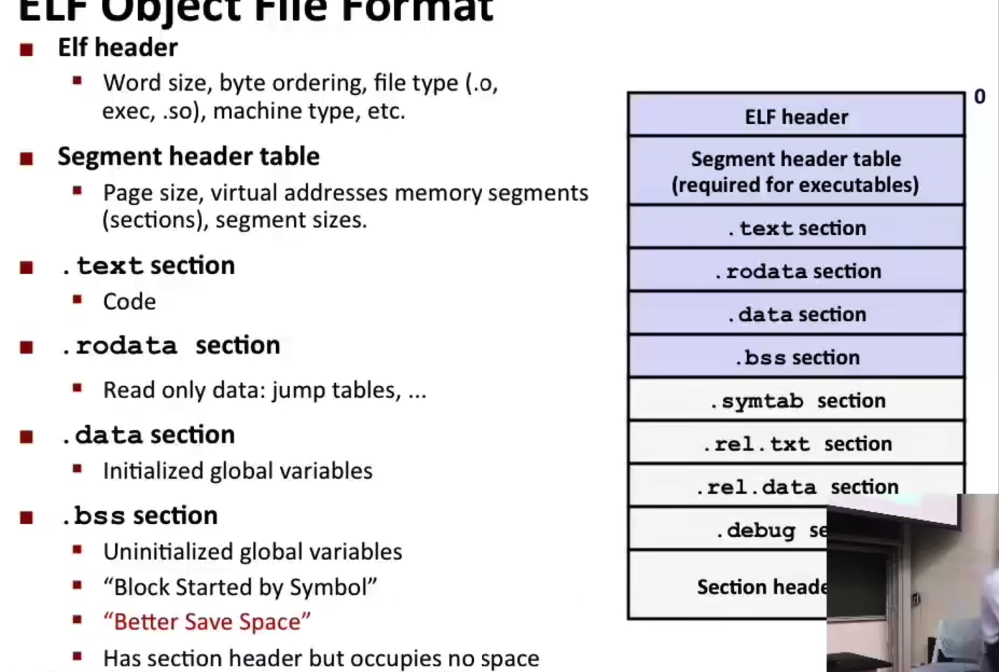
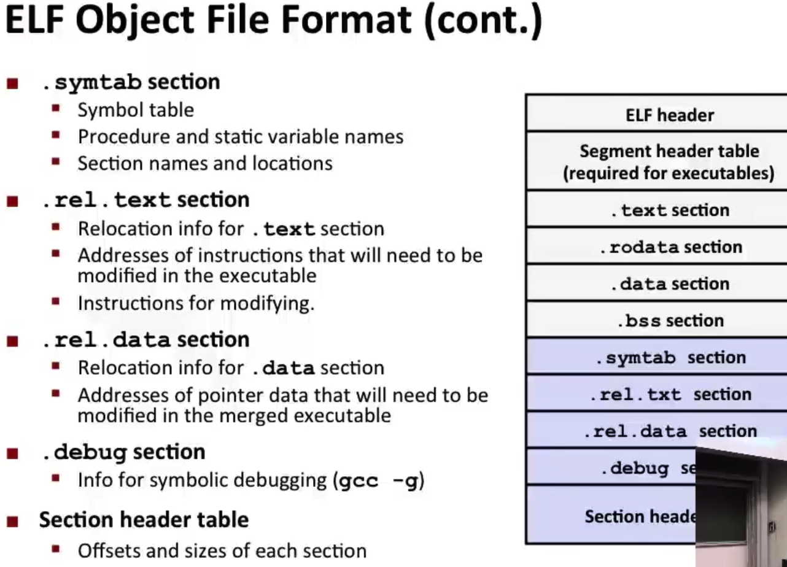

# Linking

## 为什么要选择Linkers

- Modularity

可以把代码模块化

- Efficiency

分离编译只需要重新编译更改的部分

## 链接器在做什么

### Symbol resolution

- 程序定义和引用符号（symbol）

  - `void swap() {...} ` 定义了一个symbol: swap

  - `swap()`引用了symbol: swap

  - `int *xp = &x`定义了symbol: xp, 引用了x

- symbol的定义是存储在目标文件当中的，存储在一个结构体数组当中，也叫做符号表（symbol table），包含了名称，大小，地址
- 在符号解析的过程当中，链接器组合符号的时候只能用**一个**符号定义

### Relocation

- 把分开的代码块和data部分放到单个section当中
- 根据每个符号在各自的.o文件当中的相对位置（偏移量）来重定向他们在可执行文件当中的最终绝对位置

- 根据引用情况更新符号表

## 三种目标文件(Modules)

- Relocatable object file(.o file)

包含了代码和数据（可被和其他的可重定向文件结合生成可执行的目标文件

不能直接被加载到内存当中

- Executable object file(a.out file)

包含了可以被直接复制进内存当中执行的代码和数据

- Shared object file(.so file)

可以被动态链接（load time / run time)的可重定向文件

### Executable and Linkable Format(ELF)

以上三种文件的标准二进制形式，也叫做ELF binaries

## Linker Symbols

- Global symbols

在模块当中定义的，可以被其他模块引用的

例如：非static的C 函数和非static的全局变量

- External symbols

在模块当中引用的，但是由其他模块定义的symbols

- Local symbols

只能被模块自己定义和引用的symbols

比如static定义的C 函数和全局变量

**！和局部变量没有关系**

### Local Symbols

- 非static的变量是存储在栈上的，static变量是存储在.bss或者.data上的

### 链接器如何解析重复的符号定义

- Program symbols are either strong or weak
  - Strong: procedures and initialized globals
  - Weak: uninitialized globals
- Rules

1.强符号只能定义一次

2.如果有一个强符号和多个弱符号，选择强符号

3.多个弱符号随便选一个（不要这样搞） 

### 全局变量

- 能不用就别用
- 能用static就用，能初始化数值就初始化，如果其他程序要用记得加static

## Static Libraries

- 把一系列的.o文件接起来变成单个索引文件(.a文件)
- 增强链接器，如果出现没找到的外部引用，就会去其他的archive当中寻找
- 如果在.a文件当中找到了成员文件的引用，那么把它链接到可执行文件当中

#### 静态库的算法

- 根据命令行输入的顺序，扫描.o和.a文件
- 记录下没有被解析到的引用
- 对于每一个.o或者.a文件，如果碰到一个目标，那就尝试解析每个没有解析的引用，成功就替换掉
- 如果最后有条目没有被解析则报错

这种方法会引入很多重复的函数

## Shared Libraries

动态链接发生在程序第一次被加载到内存当中，也可以是运行时可以被多个进程共享

- Load Time

先在重定向阶段把.so文件重定向，以及传递符号表的信息（部分链接）

在加载之后再引入代码和数据（完全链接）

甚至可以用dlopen在运行时打开动态链接库 

## Library Interpositioning

运行时对函数进行**包装**达到某些效果

- 记录函数被调用的次数
- 自定义调用位置和参数
- malloc追踪，包括检测内存泄漏和生成函数的地址追踪