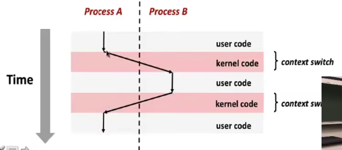
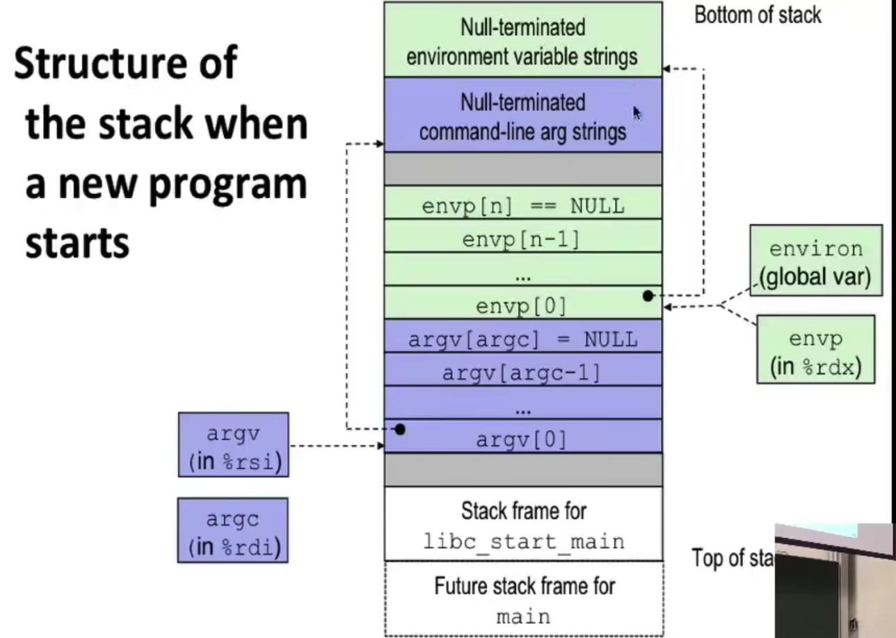
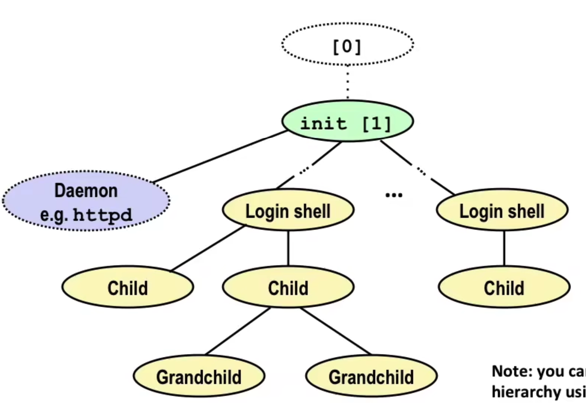
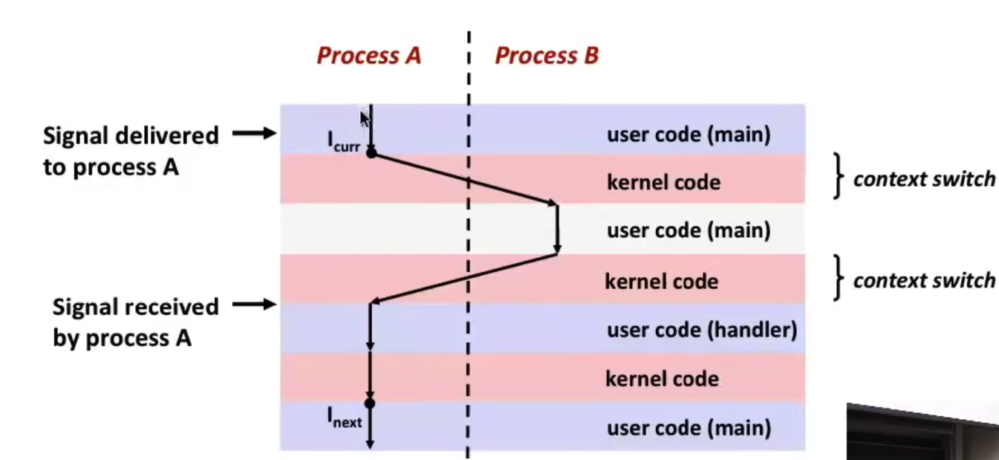

# Exceptional Control Flow

## Exceptions

指把控制权转让给操作系统内核的行为，以回应某些事件

例如除以0，算数溢出，^C

系统处理异常有三种结果

- 返回至I_current
- 返回至I_next
- Abort

#### Exception Table

每一种异常都有一个异常表对应的handle处理，是有操作系统决定的

#### Async Interrupts(异步异常)

通过设置处理器的引脚实现，返回I_next

比如sleep函数会导致中断

#### Synchronous Exceptions(同步异常)

- Traps
  - Intentional
  - 函数调用系统函数，断点或者特殊指令
  - 返回I_next
- Faults
  - Unintentional, recoverable
  - 比如页错误，浮点数错误
  - 返回I_current or Abort
- Aborts
  - Unintentional, Unrecoverable
  - 非法指令，机器检查等等
  - 废弃程序(Abort)

## System call

每个操作系统有对应的操作函数 

两个例子

```
int a[1000];
main() {
	a[500] = 1;
}
```

可能触发页错误，进入系统内核之后会把页从磁盘加载到内存中，返回I_current(mov)

```
int a[1000]
main{
	a[5000] = 1;
}
```

触发页错误，进入系统内核后检测为无效地址，进入Signal Process返回SIGSEGV，也就是segmentation fault

使用系统调用的时候一定要检查**返回值**，通常-1表示发生了错误，也可以对函数包装一层使用


## Process

一个正在运行的程序的实例

每个进程都有自己的数据，指令，控制流和私有的地址空间

进程有三种状态，running, stopped, terminated

### 单核进程调度（传统）

进程暂停的时候，把寄存器的内容拷贝到内存当中，安排寄存器给下一个程序

每个程序的内存数据和暂存的寄存器称为**上下文(context)**

### 多核进程调度（现代）

单个芯片上有多个cpu，通过**上下文切换**实现进程调度，是由操作系统内核来决定的。

### 并发和序列的程序

A ——				——

B		——

C				——		——

A和C是并发的(concurrent)，A和B是并发的，B和C是序列的(sequential)

### 上下文切换



### 系统调用函数

- `getpid()`
- `getppid()`
- `exit()`

called once but never returns

0表示正常，非0表示异常

- `fork()`

创建一个子进程，分别在父进程和子进程返回一个值，子进程为0

1.所有的栈上内容初始的时候子进程和父进程是一样的

2.子进程会获得一个单独的pid

3.由内核决定哪个进程先被运行，通过拓扑排序可以知道所有可能的调度结果

4.子进程会等到父进程被回收的时候再被回收，此时被称为zombie process，用于提供父进程自己的退出信息，之后通过父进程的`wait()`或者`waitpid()`函数，来实现**收割**，也就是回收这些僵尸进程（也就是说如果父进程永远不结束，会有很多子进程的僵尸存在）

如果有没有被回收的子进程，系统会通过**init进程(pid == 1)**来回收这些孤儿进程

- `wait(int *child_process)`

等待直到一个子进程结束为止，可以用一些宏来控制，

```
void fn(){
	int child_process;
  if (fork() == 0){
  	do_sth();
  }
  pid_t wpid = wait(&child_process);
  if(WIFEXITED(child_status)){
  	print("Child %d terminated with exit status %d\n", wpid, WEXITSTATUS(child_process))
  }
}
```

- `int execve(char *filename, char *argv[], char *envp[])`

在进程内加载和运行其他进程




 ## Linux Process Hierarchy



### Shell

通过一行buffer来读取输入的命令，如果是^D就推出shell，否则继续

通过`eval()`函数来执行命令

shell当中以&操作符来决定是否在前台运行，有则在后台运行

shell通过pgid(进程组信息)来控制前后台的进程和子进程

- `ps`

查看在shell当中运行的进程信息

S: sleeping

T: stopped

R: running

s: session leader

+: foreground proc group


### Signals

每一个信号都有一个对应的整数，1-30，通过信号来传递程序运行的状态信息

程序会接受来自系统内核传递来的信号并且处理，有三种方式

- 忽略信号
- 终止信号
- 通过signal handler来接收信号并且处理

信号有时会处于**待处理(pending)**状态，最多只能有一个待处理的信号

进程也可以阻塞信号来屏蔽一些信号

以上的信号都是通过一个比特向量来实现的，阻塞信号即引入一个掩码`sigprocmask`进行一定的操作

#### Receive Signals

处理发生在控制权从内核转移到用户的时候

内核处理信号的时候遵从`pnb = pending & ~blocked`

If pnb == 0: pass signal

Else:从pnb当中选取的最小非零位，会在进程内起到一些作用，循环这个过程直到获取所有的非0位，之后转移控制权

#### Signal handler



- handler甚至可以被其他的handler处理

- 编写handler程序的时候一定要**安全**，不要去动程序的设计

  - G0:设置一个全局的flag然后返回
  - G1:只用异步安全的函数，像是exit，printf都是不安全的，因为printf必须要取得terminal的进程锁
  - G2:存储errno
  - G3:暂时屏蔽所有信号来保护数据
  - G4:声明全局变量的时候要用volatile关键词，这样就不会存储在寄存器当中
  - G5:用Atomic来包装变量

  