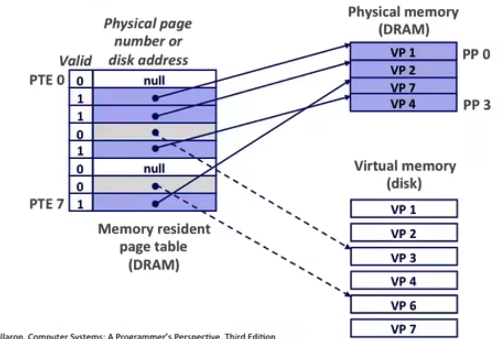
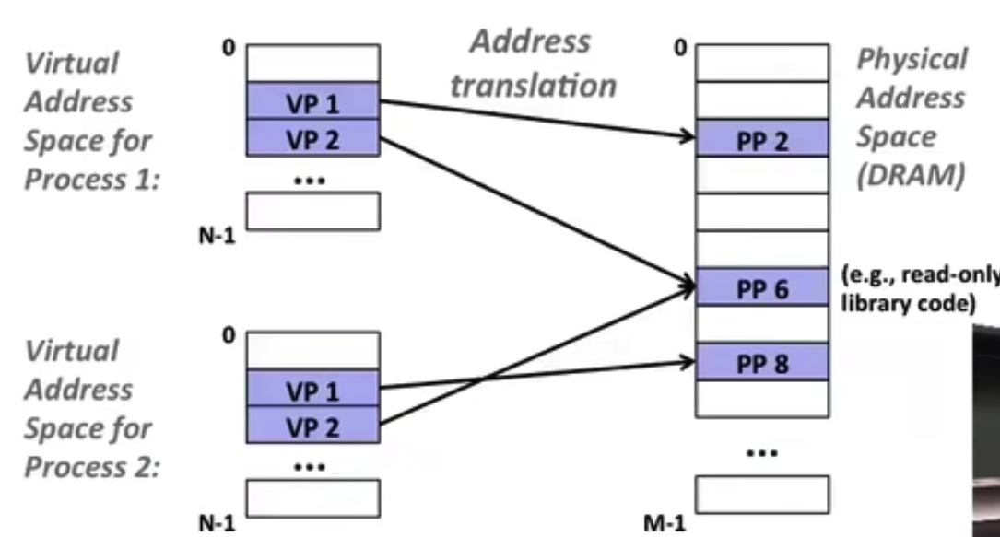
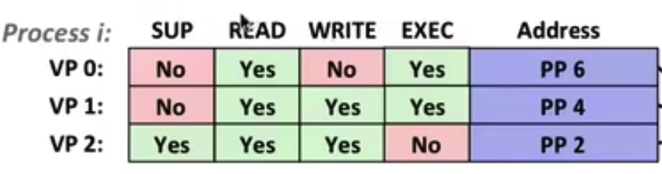
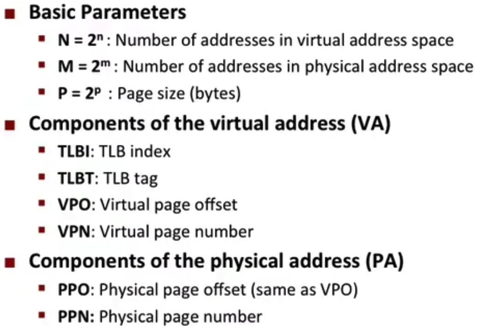
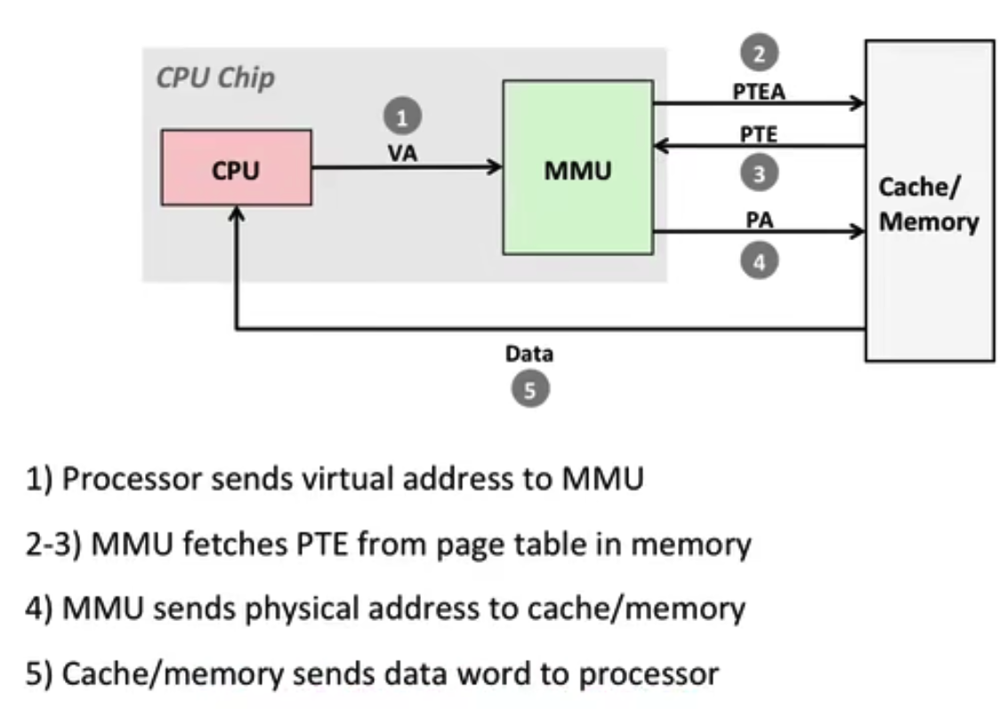
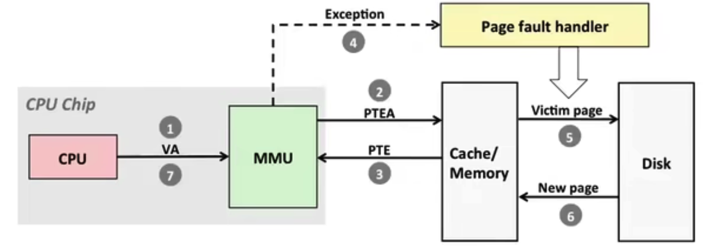
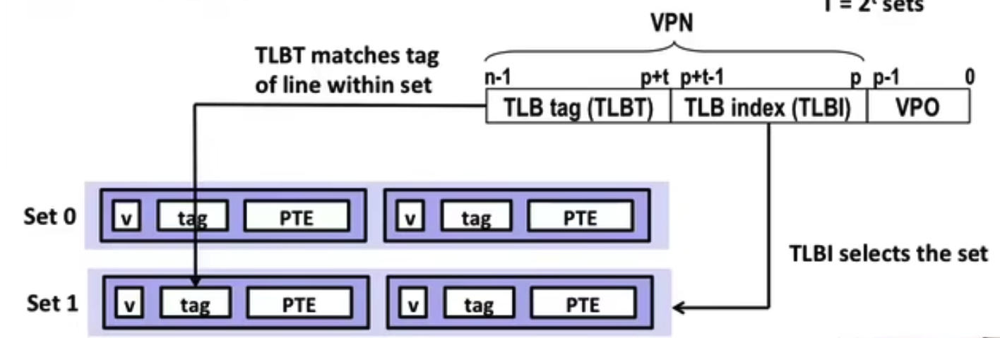
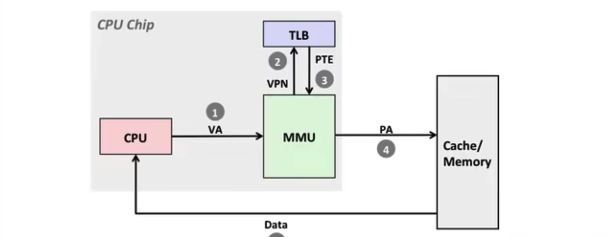
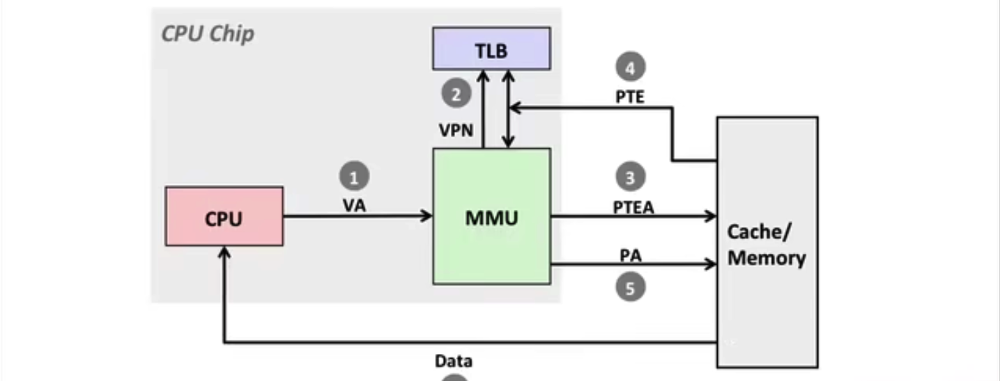
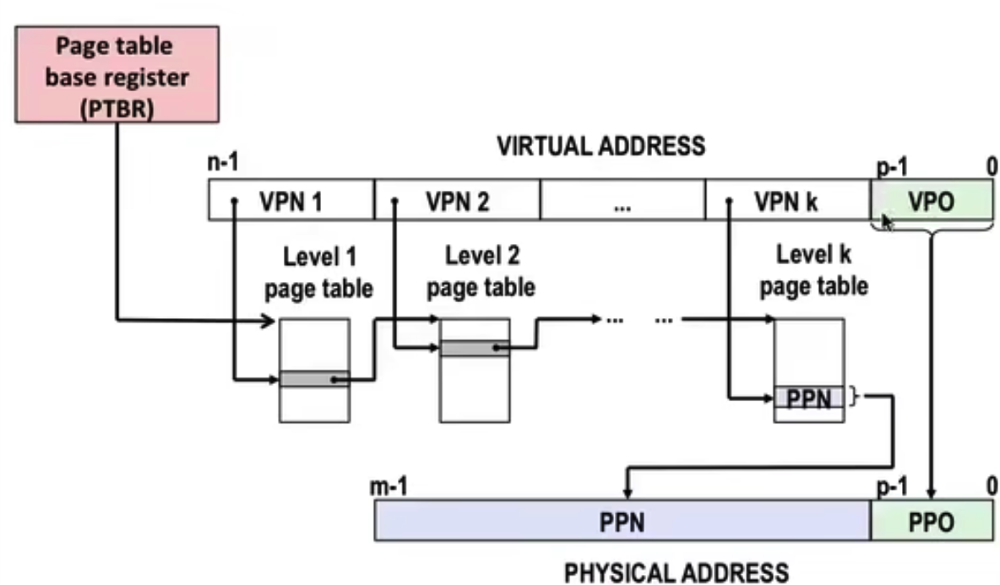

# Virtual Memory

## Address Spaces

- Linear address space

连续的，非负的整数地址
$$
\{0,1,...,n\}
$$

- Virtual address space

n位虚拟地址代表$N=2^n$个虚拟内存地址
$$
\{0,1,...,N-1\}
$$

- Physical address space

m位物理地址代表$M=2^m$个物理内存地址
$$
\{0,1,...,M-1\}
$$

## Why VM？

- 把DRAM作为虚拟内存的cache，更高效地利用主存
- 简单化内存管理

让每个进程都有类似的内存形式，分布在主存当中

- 分离地址空间

一个进程不能访问另一个进程的地址空间，用户进程不能访问系统进程的地址空间

### VM as a tool of caching

虚拟内存的内容是存储在磁盘上的，而DRAM也就是物理内存相当于虚拟内存的cache

- 这些cache是以**页(page)**的形式交互的

### DRAM cache organization

由于磁盘和DRAM的效率差距过大，所以cache miss会造成非常大的代价

- page非常大
- 全组相连，每一个VP(Virtual Page)能被映射到任意一个PP(Physical page)

#### Page Table

An array of page table entries(**PTEs**),是从VP到PP到一个映射表

实线表示映射到物理内存

虚线表示一个指针指向虚拟内存，也就是磁盘的地址

- Page Hit

通过Valid Bit来判断

命中，一个指向虚拟内存地址的引用，通过页表查找之后发现并**在**物理内存当中

- Page Fault

未命中，一个指向虚拟内存地址的引用，通过页表查找之后发现并**不在**物理内存当中，会引发一个exception

通过一个程序从磁盘当中找到VP，更新页表，并且写到物理内存当中

**重新执行查找程序**，这个时候发现page hit

#### Allocate Pages

通过`malloc()`函数申请一块虚拟内存地址，malloc会调用`sbrk()`函数来分配页表

把页表当中的null改成指向虚拟内存地址的指针，当真正用到的时候触发page fault，再写到物理内存当中

这样看起来很慢，因为每第一次访问内存都需要访问磁盘

- Locality to the rescue again

  在实际工作的时候，程序访问的VP的集合称为**working set**

  - if (working set < main memsize)

  由于局部性原理，除了必要的miss之外效率都很高

  - if(sum (working set) > main memorize)

  当太多进程所用的working set大小总和超过主存的时候，会发生**抖动(Thrashing)**，效率断崖式降低，因为page一直在被in/out来回切换

### VM as a tool for memory management

每个进程都有自己独立的地址空间

用VM的好处是，

- 只要关心VM当中地址空间是连续的就行，因为会通过PTE映射到物理内存当中的任意位置，这样内存能被更大程度地利用，不用担心碎片化
- 像是共用的库和只读数据，比如只读的c库可以映射到相同的位置，节省内存空间
- 简化链接和加载

比如说一个进程当中有一个巨大的数组，但是实际只访问其中的一小块，加载的时候只需要分配这一小块的物理内存即可

### VM as a Tool for Memory Protection

在X86-64架构的芯片当中，只使用低48位的地址，剩下的高位为全1或者全0，全1为kernal保留，全0给用户使用

可以在PTE当中添加一些设置位来设定安全性

MMU在访问的时候都会检查这一些位

SUP:指定是用户还是系统能够操作

EXEC bit只在64位下才有，32位下不存在

## VM Address Translation

先规定一些设定和符号

### Page hit

### Page Fault

- 加入缓存之后，机制也是类似的

### Translation Lookaside Buffer(TLB)

缓存部分的PTE以加速地址翻译，是以组相连的形式来存储的

- TLB Hit

- TLB miss

### Address Translation

*CSAPP*: P573-576,

## Multi-Level Page table

多级页表可以解决页表过多的问题，比如页表之间间隔过长，就可以在二级页表当中存储位置

从数学上来看，相当于多赋值一个坐标来减少寻址的消耗

- 虚拟地址在多级页表下单结构图

