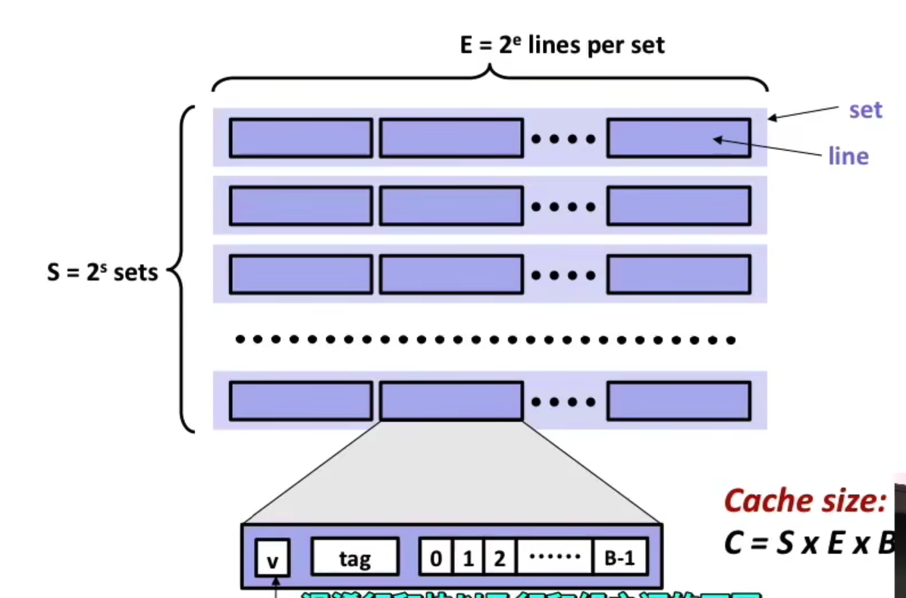

# Chapter 11: The memory hierarchy


## Cache replacement

- LFU(Least frequentlyy used)

一段时间内全部清零，调用一次计数器+1，替换计数器最小的

- LRU(Least Recently Used)

每hit一次，计数器增加1，替换的时候换计数器最小的

- Random

随机替换，但是会降低效率

## Cache Misses

- Cold miss

Cache starts empty and this is the first reference to the block，也就是cache没有被热身，是空的

- Capacity miss

```c
while(1) {
  scan(a[i]) // n > capacity
}
```

如果采用最远没用过的被替换的策略，cache会失效（cache被重复的替换）

方法：增加cache memory

1.升级机器，增加缓存

2.取缔剩下的进程，获得额外的高速缓存

- Conflict miss

多个k+1级的cache被映射到k级cache的同一块


## Generai Cache Organization

- SEB 模型



