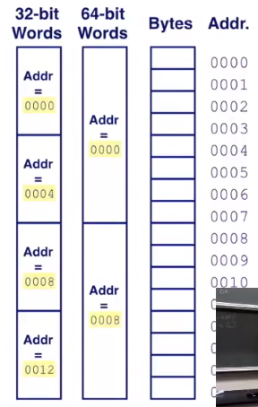
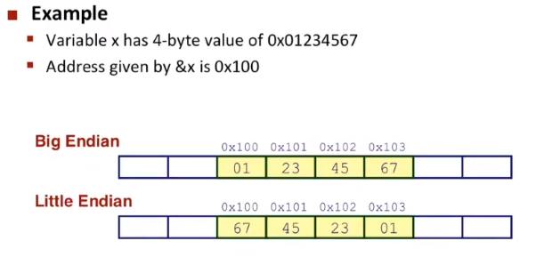

# Chapter 3: Bits, Bytes, And Integer Count

#### Unsigned Addition

```
UAdd(u, v) = u + v mod 2^w
0b1101 + 0b0101 == (1)0010;// 1 was erased
```

#### Integer Addition

- 两个w位相加，最多需要w+1位来存储

```
  1 1 0 1  -3
+ 0 1 1 0  6
-----------------
= 0 0 1 1  3


  1 1 0 1  -3
+ 1 0 1 0  -6
--------------------
= 0 1 1 1  -7
// Negative Overflow!

  0 1 1 1  7
+ 0 1 0 1  5
-------------------
= 1 1 0 0  -4
// Positive Overflow!
```


#### Multiplication

- 两个w位相乘，最多需要2w位来存储

两个无符号数相乘
$$
UMult_{w}(u,v) = u*v mod 2^{w}
$$
标准乘法当中，高于w位将被忽略，低于w位不变

- 移位运算

左移运算：$x << k = x * 2^{k}$

右移运算：$x >> k=\lfloor x/2^{k} \rfloor$，使用逻辑右移

**在c语言定义当中，无符号数右移一定是逻辑右移，有符号数不确定，在绝大部分机器上都是算数右移**

- 负数除法偏移量问题

```
1 0 1 0  -6
1 1 0 1  -3 // 负数算数右移，6变成3
1 1 1 0  -2 // 如果不引入偏移量，-3右移会变成-2
// 引入偏移量之后
1 1 0 1  -3
/ / / 1  
1 1 1 0 // 和偏移量相加之后再右移
1 1 1 1  -1 // 和预期结果相符
```

编译器会根据输入自动优化，即使如此除法运算也是非常慢的，需要30个Halk Cycle，相比之下乘法只需要三个，所以要尽可能的避免除法

#### X => -X

- 按位取反再加一

```
1 0 1 0  -6
0 1 0 1  // 按位取反
0 0 0 1
0 1 1 0  6
```

- **不对称性**

根据这个规则，TMIN(0b10000000)取反还是自己，会有特例出现

#### Why Should I Use Unsigned

一个经典案例

```
#define delta sizeof(int)  --> unsigned
int i;
for (i = cnt; i-delta >= 0; i-=delta)// i was casted into unsigned
```

替代方法

```
unsigned i;// or use size_t
for(i = cnt-2; i < cnt; i++)
```

如果这里cnt<0，会被转化成非常大的正数，因为类型转化的存在

#### Machine Words

- 64位和32位到底表示什么？

  - 32位

  32bits(4bytes)，最大地址大概是4gb(2^32 bytes)

  - 64位

  即使并非64位都可以用，这个数字都是很大的，通过换底公式可以估算有多少位，如果全都可用大概是在18PB左右

- Memory

一个地址会被分4个字节（32bits），8个字节（64bits）




#### Byte Ordering

- Little Endian(小端存储)

x86, ARM processors

**Least significant byte has lowest address**

- Big Endian:

Sun, Internet

**Least significant byte has highest address**



#### String

char set with `0x00`at last
