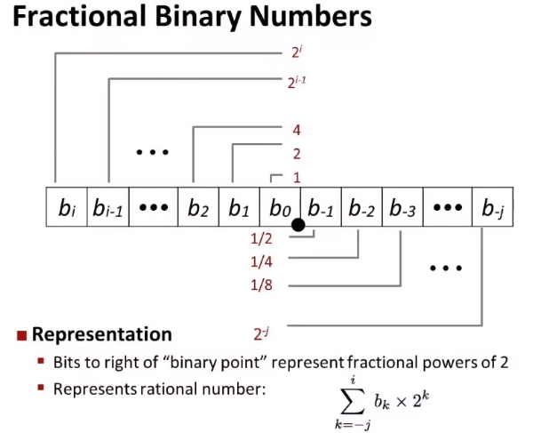
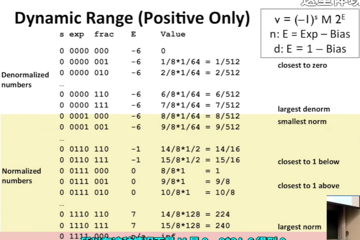
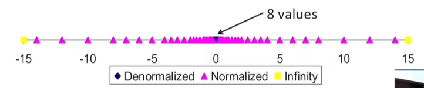
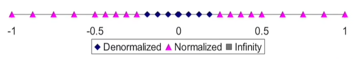
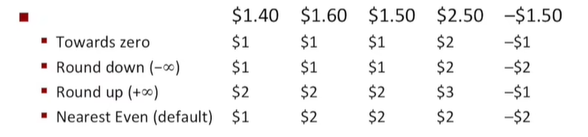
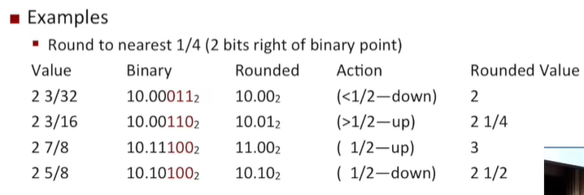

# Chapter 4 Floating Point

#### 二进制表达方式



- 2整数次幂分母

$5+3/4=101.11_{2}$

$1+7/16=1.0111_{2}$

- 非2整数次分母用循环表示

#### 浮点数的表示方法

- 数学形式（二进制科学计数法）

$$
(-1)^{s}M2^{E}
$$

s: 决定浮点数是正还是负

M:通常是一个$[1.0,2.0)$上面的一个分数

E:2的指数

- 编码形式

```
s|exp           |frac                                    
```

s为符号位，exp是E的编码，frac是M的编码

- 精度选择

单精度32位：1|8|23

双精度64位：1|11|52

#### 精度和偏差问题

$$
E = Exp-Bias
$$

Exp:unsigned

Bias:$2^{k-1}-1$,对于float来说是127，double是1023

- 用frac可以省一位，例如100.01，先左移浮点变成1.00xx

#### 浮点数表示法举例

`float F = 15213.0`
$$
\begin{align}
15213_{10} &= 11101101101101_{2}\\
&=1.1101101101101_{2}*2^{13}\\
\end{align}
$$
由单精度frac位一共23位即可得知
$$
frac=\underline{1101101101101}0000000000_{2}
$$
然后我们来计算Exp
$$
\begin{align}
E &= 13 \\
Bias &= 127 \\
Exp &= 13 + 127 = 140 = 10001100_{2}
\end{align}
$$
最后我们就可以得到单精度浮点数
$$
\underbrace{0}_{s}\underbrace{10001100}_{exp}\underbrace{11011011011010000000000}_{frac}
$$

- 我们来看一下几个参数的表示范围

$$
0 \leq exp \leq 255 \\
-127 \leq E \leq 128
$$

#### 非标准化的值

- $exp=000..0$

- 指数:$E=1-Bias$  instead of 0 - Bias

#### 特殊值

- $exp=111..1$

- 如果$frac=000..0$

表示$\infty$，$1.0/0.0=-1.0/-0.0=+\infty,1.0/-0.0=-\infty$

- 如果$frac \neq 000..0$

表示NaN，例如$\sqrt{-1},\infty-\infty,\infty*0$



#### 浮点数的分布





- 每一段区间内（阶码）相同，浮点数之间的间隔相同，阶码相差1，间隔距离相差两倍

#### 浮点数的运算

$$
x (+_{f})y=Round(x+y)\\
x(*_{f})y=Round(x*y)
$$

##### Round：舍入

在IEEE规则中，规定以下四种舍入方式(以下为Base10)



- 向偶数舍入问题

满足四舍六入规则，只有在中间数的时候才要向偶数舍入
$$
Round(7.8949999)=7.89\\
Round(7.8950001)=7.90\\
Round(7.8950000)=7.90\\
Round(7.8850000)=7.88
$$

- 二进制舍入



##### 浮点数乘法运算

$$
(-1)^{s}M2^{E}=(-1)^{s1}M_{1}2^{E1}*(-1)^{s2}M_{2}2^{E2}
$$

- 符号位：异或运算，$s=s1\wedge s2$

- M：无符号乘法运算，如果$M\geq2$则右移M，指数位增加
- E: $E = E1+E2$，溢出则变成无穷大

###### 乘法运算数学性质

- 有交换律，但是没有结合律

$$
(1e10*1e10)*1e-10=inf\\
1e10*(1e10*1e-10)=1e10
$$

- 对加法也没有分配律

$$
1e10*(1e10-1e10)=0.0\\
1e10*1e10-1e10*1e10=NaN
$$


##### 浮点数加法运算

- Step1: 判断指数位数的大小，把小的指数进行基数右移，使得frac部分对齐

$$
(-1)^{s1}M_{1}2^{E1}+(-1)^{s2}M_{2}2^{E2},assume E1>E2
$$

- Step2:计算结果，指数位为较大位

$$
(-1)^{s}M2^{E},E=E1
$$

- Step3:修正
  - 如果$M \geq 2$,右移M，增加E
  - 如果$M<1$,左移M，减小E
  - E越界溢出则变成无穷
  - 把M进行舍入操作，以保持精度不变

###### 加法运算的数学性质

- 有交换律，但是没有结合律

$$ {begin{}
(3.14+1e10)-1e10=0\\3.14+(1e10-1e10)=3.14
$$

- 除了无限点之外，满足基本代数的加法性质，如有加法逆元，加法满足单调性，直到正无穷为止

#### 浮点数与整数类型转换

-  整形转换成浮点型

如果是int->double，因为frac部分足够存储整数的信息，所以不会丢失精度，只会进行扩张

如果是int->float，单精度frac部分无法足够存储int的位数，所以会丢失精度

- 浮点型互相转换

double->float可能被舍入，也可能变成inf

- 浮点型转换成整形

浮点数被**向零舍入**，也有可能溢出，会被处理器指定一个**整数不确定**值
