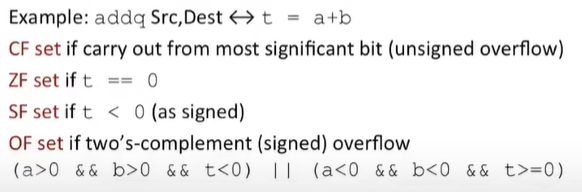
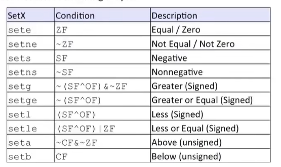
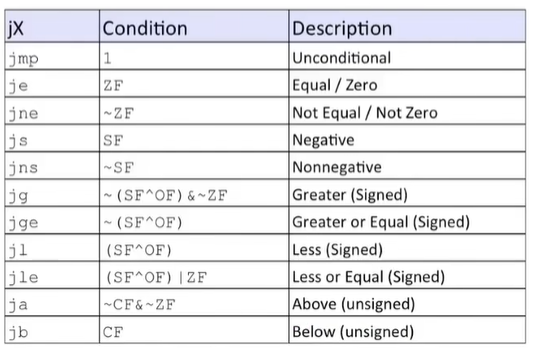

# Chapter 6 MLP Control

## 控制状态码(Condition codes)

- `%rip`:Instruction pointer

#### 单位寄存器

- `CF`:Carry Flag(unsigned)（进位表示符）
- `ZF`:Zero Flag，最近的操作得到了0
- `SF`:Sign Flag(signed)，1表示负，0表示正
- `OF`:Overflow Flag(signed)，补码溢出

#### 内部设置状态码

下面以`addq`为例



`lea`不会设置这四个位
#### 外部设置状态码

- `cmp_ Src2 Src1`

  起到类似于`S2-S1`的结果

  可以在外部设置这些状态码，通常用于比较两个数

- `test_ Src2 Src1`

  起到类似于`S2 & S1`的结果

  同样可以在外部设置状态码，通常用于测试一个数

#### 访问条件码

- `set_`指令只改变最低1个字节，不改变剩下的高位字节



- 例子

```c
int gt (long x, long y){
    return x > y;
}
```

```assembly
cmpq %rsi, %rdi # cmp x:y
	setg %al  # set when >
	movzbl %al, %rax
	ret
```

`movzbl`/`movzbq` 是在32/64位下常用置零表示方式

## 条件分支

### 跳转

- `jX`根据状态码跳转到代码的不同部分



- 例子

```c
long absdiff(long x, long y){
    long result;
    if (x > y)
        result = x - y;
    else
        result = y - x;
    return result;
}
```

``` assembly
# %rdi : x
# %rsi : y
# %rdx : return value
absdiff:
	cmpq %rsi, %rdi
	jle .L4
	movq %rdi, %rax
	subq %rsi, %rax
	ret
.L4:
	movq %rsi, %rax
	subq %rdi, %rax
	ret
```

