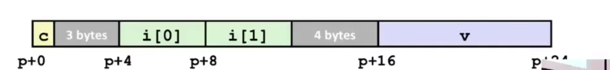

# Chapter 8: MLP data

## Arrays

- Allocation

在c语言当中，数组一定是顺序（连续）存放的，占用的空间是sizeof(T)

- 地址计算

通过数组指针加上一个偏移量i来定位数据位置，例如`short[i+3]`的值就是`Mem(X_a + 2*i + 6)`

在c语言当中并没有越界检查的操作，所以可能发生数组的越界

- 对于数组的指针运算例子


### 汇编语言实现

一个简单的取出数组中数据的例子

```c
int get_digit(arr z, int index) {
  return z[index];
}
```

```assembly
# %rdi = z
# %rsi = index
movl (%rdi, %rsi, 4), %eax
```

### 多维数组

- 嵌套数组

以一个`int[5][3]`为例，汇编会以伸缩和加法的特性来进行二位数组
$$
D[i][j]=x_d+L(C*i+j)
$$
先把变量i伸缩c倍`leaq(%rsi, %rsi, 2), %rax`（计算3i）

再计算$x_A + 3i$`lead(%rdi, %rax, 4), %rax`

最后通过一位数组寻找找到数据`movl(%rax, %rdx, 4), %eax`


## Struct

类似于数组，通过偏移量来确定元素位置

### 对齐

从小向大对齐



可以采用贪心算法，把结构体内的数据从大到小排列


## 浮点数

浮点数存储在一个`%xmm`存储器当中