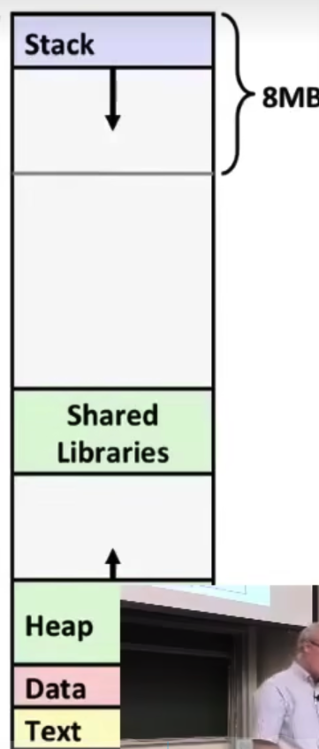
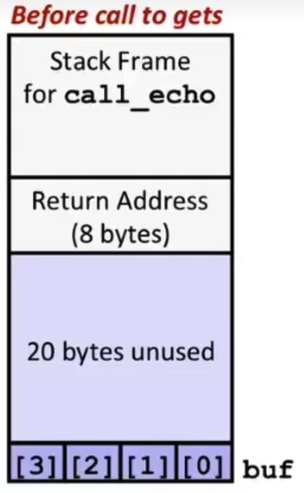
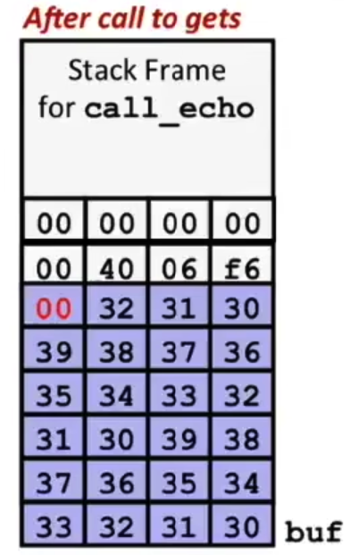
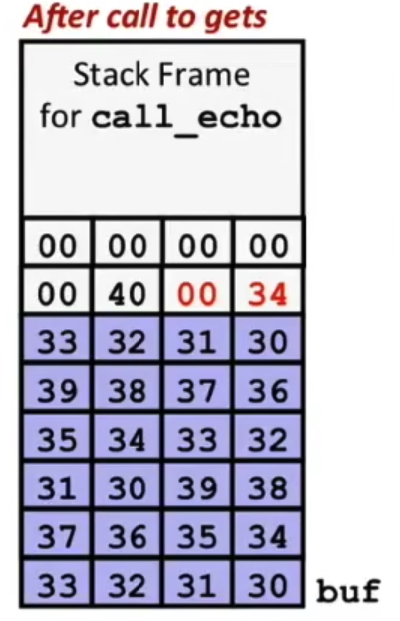
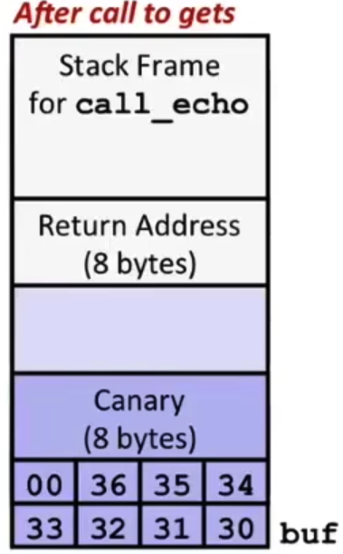

# Chapter 9 MLP Advance

## X86-64 Linux Memory Layout

从高地址到低地址分为以下几个部分

### Stack

- 运行时的栈，存储局部变量，指令等等
- 最多8mb

### Heap

- 动态分派的内存位置，比如说`malloc()`

### Data

- **静态（Statically）** 分配的数据，比如全局变量，带`static`关键字的变量，字符串常量等等

### Text/ Shared Libs

- 只读
- 可执行的机器指令



看图，堆内存申请到越多，堆会往**高地址**增长，相反越多的栈内存会往**低地址**增长


## Buffer Overflow

- `char* gets(char* dest)`

不检查缓冲区的边界问题，不检查输入字符串的大小导致的问题

类似的函数也有这些问题，比如`scanf(), fscanf(), scanf()`

```c
void demo_echo(char* str){
  char buf[4];
  gets(str);
  puts(str);
}
```

超过了buf的边界会发生segmentation fault，这里调用了四个字节的buf，但是汇编当中系统会分配24个，也就是说如果输入的字符串超过23个字节之后会出错（字符串以\0）结束

这里已经超过了缓冲区，到了中间的地方但是不会出错

- 图示如下

函数调用之前



函数调用之后（23个字符）



函数调用之后（25个字符）



### Code Injection Attacks

就是通过这种方式，让上一个函数返回到一个攻击函数到的位置，继续执行

 

### 应对攻击的方法

- 使用更加安全的函数，比如fgets
- 栈部分内存随机分配，运行时候改变变量的位置
- 设置权限，rwx
- canary（金丝雀）

足够安全，目前没人能破解

保护堆栈的内存，防止溢出，现在是默认的（bomb lab当中的stack check）

在栈和堆当中分配一块区域，如果被堆影响到，则会测试失败报错



```assembly
echo:
	movq 8($rsp), %rax
	xorq %fs:40, %rax
	je .L6 # pass the test
	call __stack_chk_fail # failed
```

### 应对保护的攻击

- ROP：return oriented programming

一般来说是找不到栈的位置的，但是可以用小型片段的组合(gadgets)，有些可能被执行

这些代码都是以ret结尾的，也就是0xc3（X86）

- 例子

```c
long abc (long a, long b, long c){
  return a*b + c;
}
```

```assembly
<ab_plus_c>:
	4004d0: 48 0f af fe imul %rsi, %rsi
	4004d4: 48 8d 04 17 lea (%rdi, %rdx, 1), %rax
	4004d8: c3          retq
```

4004d4~4004d8就是gadgets所在的位置，也就是需要攻击的地方

当然也可以是半行代码的攻击


## Union

让多个结构同时用一块域

```c
typedef union {
  float f;
  unsigned u;
} bit_float
  
float b2f(unsigned u){
  bit_float arg;
  arg.u = u;
  return arg.f;
}
```

这样可以做到把浮点数和整形按位转换

当然，大端存储和小端存储也会造成问题


